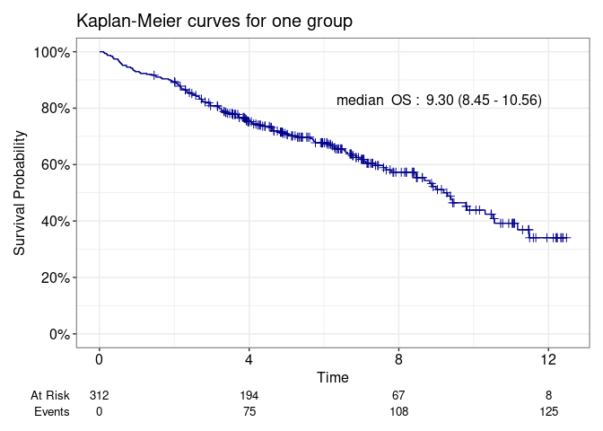

<!-- README.md is generated from README.Rmd. Please edit that file -->

# visTimeEvent

<!-- badges: start -->
<!-- badges: end -->

The goal of visTimeEvent is to quickly generate well-formatted
Kaplan-Meier or cumulative incidence curves, with or without competing
risks.

## Installation

You can install the development version of visTimeEvent from
[GitHub](https://github.com/KGutmair/visTimeEvent) with:

``` r
# install.packages("pak")
pak::pak("KGutmair/visTimeEvent")
```

# Description

This package provides functions for creating Kaplan-Meier and cumulative
incidence plots. These functions serve as wrappers for ggsurvfit() and
cuminc(), allowing for the quick generation of well-formatted
visualizations. Users can choose to display the median time-to-event
probability, median cumulative incidence, or event probability at a
specific timepoint along with corresponding confidence intervals. When
comparing two groups, the plot includes the p-value from the appropriate
hypothesis test for assessing differences between them.

Following functions are available:

- Kaplan-Meier curves:

  - `km_single`: This function plots the Kaplan-Meier curve for a single
    group.

  - `km_grouped`: This function plots the Kaplan-Meier curve stratified
    by two groups. The p-value from the log-rank or Wilcoxon test is
    included in the plot.

  - `km_grouped_weighted`: This function plots weighted Kaplan-Meier
    curves for two groups, using weights such as those from Propensity
    Score Inverse Probability of Treatment Weighting (IPTW) or other
    methods. The p-value from the stratified log-rank test is also
    displayed.

- Cumulative incidence curves:

  - `comp_risk_single`: This function plots the cumulative incidence
    curves for competing events.

  - `comp_risk_grouped`: This function Plots cumulative incidence curves
    for two groups with competing events, showing only the first event.
    The p-value for comparing the curves is also displayed.

# Example

``` r
library(visTimeEvent)
#> Registered S3 method overwritten by 'mosaic':
#>   method                           from   
#>   fortify.SpatialPolygonsDataFrame ggplot2
library(dplyr)
library(survival)

test_dat <- survival::pbc
test_dat <- test_dat %>%
  mutate(status_death = ifelse(status == 2, 1, 0),
         status_death = as.integer(status_death),
         time = time/365,
         trt = as.factor(ifelse(trt == 1, "treatment", "placebo")),
         trt_num = ifelse(trt == "treatment", 1, 0),
         status = as.factor(status)) %>%
  filter(!is.na(trt))
```

``` r
plot_km <- km_single(data = test_dat,
          time = "time",
          event = "status_death",
          title = "Kaplan-Meier curves for one group",
          unit = "years",
          endpoint = "OS",
          colors = "darkblue",
          show_label = "median")
#> [1] "Following options were chosen: "
#> [1] "- time-to-event probability of 1 years"
plot_km[[1]]
```



``` r
plot_km1<- km_grouped(data = test_dat,
          time = "time",
          event = "status_death",
          group = "trt",
          time_survival = 6,
          test = "wilcoxon",
          title = "Kaplan-Meier curves for two groups",
          unit = "years",
          endpoint = "OS",
          colors = c("darkblue", "darkgreen"),
          show_label = "probability")
#> [1] "Following options were chosen: "
#> [1] "- significance test: wilcoxon"
#> [1] "- time-to-event probability of 6 years"

plot_km1[[1]]
```


``` r
plot_cum <- comp_risk_single(data = test_dat,
                 time = "time",
                 event = "status",
                 title = "Competing risk of a single group",
                 unit = "years",
                 colors = c("darkred", "darkblue"),
                 show_label = "probability",
                 time_survival = 8)
#> [1] "1" "2"

plot_cum[[1]]
```


